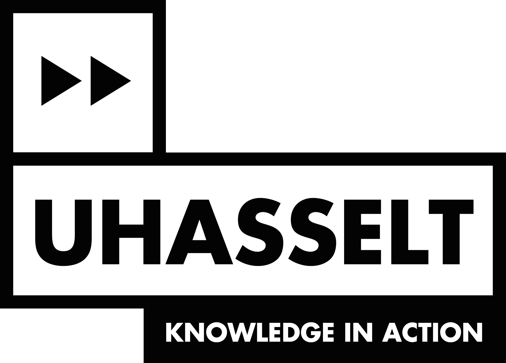

```{r include = F}
htmltools::includeHTML("tracking_google_analytics.html")
library(pander)
```


| | |
|---------------|-------------------------------------------------------|
|  | The main bupaR packages have been developed by the Business Informatics research group of Hasselt University, and are maintained by Gert Janssenswillen. The packages are available under [MIT license](about.html#license). Contributions can be made through our [github repositories](about.hmtl#contribute). Subscribe to our [newsletter](about.html#newsletter) in order to get informed on new releases. |

<br/>
<br/>

## Contact

Gert Janssenswillen<br/>
Hasselt University<br/>
Campus Diepenbeek<br/>
Agoralaan Building D<br/>
[gert.janssenswillen@uhasselt.be](mailto:gert.janssenswillen@uhasselt.be) <br/>
[www.janssenswillen.com](http://www.janssenswillen.com)

Research Group Business Informatics<br/>
[www.businessinformatics.be](http://www.businessinformatics.be)

<br/>
<br/>

## CRAN Releases

Below you find a list of the current releases of the packages:

*	0.4.0 [bupaR](https://cran.r-project.org/package=bupaR)
*	0.8.0 [edeaR](https://cran.r-project.org/package=edeaR)
*	0.2.0 [eventdataR](https://cran.r-project.org/package=eventdataR)
*	0.1.0 [petrinetR](https:/cran.r-project.org/package=petrinetR)
*	0.3.1 [processmapR](https://cran.r-project.org/package=processmapR)
*	0.1.0 [processmonitR](https://cran.r-project.org/package=processmonitR)
*	0.2.2 [xesreadR](https://cran.r-project.org/package=xesreadR)

### By other maintainers

*	0.1.1 [processanimateR](https://cran.r-project.org/package=processanimateR), maintained by [Felix Mannhardt](https://fmannhardt.github.io/processanimateR/)

<br/>
<br/>

## Contribute

The source code of all the packages is available on __github__, so that you can directly contribute to the packages. If you want to contribute by creating new compatible packages, feel free to contact us.

```{r  results='asis', echo = F}
table <- "
	Package | Link | 
	bupaR	|	[github.com/gertjanssenswillen/bupaR](https://github.com/gertjanssenswillen/bupaR)	| [Submit issue](https://github.com/gertjanssenswillen/bupaR/issues)		
	edeaR	| 	[github.com/gertjanssenswillen/edeaR](https://github.com/gertjanssenswillen/edeaR)	| [Submit issue](https://github.com/gertjanssenswillen/edear/issues)
	eventdataR	| 	[github.com/gertjanssenswillen/eventdataR](https://github.com/gertjanssenswillen/eventdataR) | [Submit issue](https://github.com/gertjanssenswillen/eventdatar/issues)	 
	processmapR	| 	[github.com/gertjanssenswillen/processmapR](https://github.com/gertjanssenswillen/processmapR)	 | [Submit issue](https://github.com/gertjanssenswillen/processmapR/issues) 
	processmonitR |	[github.com/gertjanssenswillen/processmonitR](https://github.com/gertjanssenswillen/processmonitR)	 | [Submit issue](https://github.com/gertjanssenswillen/processmonitr/issues) 
	petrinetR	| 	[github.com/gertjanssenswillen/petrinetR](https://github.com/gertjanssenswillen/petrinetR)	 | [Submit issue](https://github.com/gertjanssenswillen/petrinetr/issues)
	xesreadR	| 	[github.com/gertjanssenswillen/xesreadR](https://github.com/gertjanssenswillen/xesreadR)| [Submit issue](https://github.com/gertjanssenswillen/xesreadr/issues)	 

"
df <- read.delim(textConnection(table),header=FALSE,sep="|",strip.white=F,stringsAsFactors=FALSE)
names(df) <- unname(as.list(df[1,])) # put headers on
df <- df[-1,] # remove first row
row.names(df)<-NULL
pandoc.table(df, style = 'rmarkdown', justify = "left", split.table = Inf)
```
<br/>
<br/>


## License

The following license is applicable to all packages maintained by Hasselt University.

Permission is hereby granted, free of charge, to any person obtaining A copy of this software and associated documentation files (the "software"), to deal in the software without restriction, including Without limitation the rights to use, copy, modify, merge, publish, Distribute, sublicense, and/or sell copies of the software, and to
Permit persons to whom the software is furnished to do so, subject to The following conditions:

The above copyright notice and this permission notice shall be Included in all copies or substantial portions of the software.

The software is provided "as is", without warranty of any kind, Express or implied, including but not limited to the  warranties of Merchantability, fitness for a particular purpose and Noninfringement. In no event shall the authors or copyright holders be Liable for any claim, damages or other liability, whether in an action Of contract, tort or otherwise, arising from, out of or in connection With the software or the use or other dealings in the software.

Year: 2016-2018 <br/>
Copyright holder: Hasselt University


## Newsletter
```{r echo = F}
htmltools::includeHTML("mailchimp.html")
```


