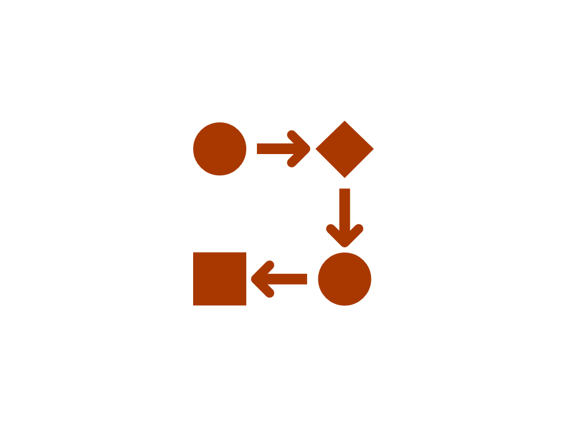

```{r echo = F, out.width="25%", fig.align = "right"}

```

```{r include = F}
library(bupaR)
```

***

# Control-flow analysis

## Metrics

### Activity Presence

Activity presence shows in what percentage of cases an activity is present. It has no level-argument.

```{r}
patients %>% activity_presence() %>%
	plot
```


### Activity Frequency

The frequency of activities can be calculated using the activity_frequency function, at the levels log, trace and activity.

```{r}
patients %>%
	activity_frequency("activity")
```

### Start Activities

The start of cases can be described using the start_activities function. Available levels are activity, case, log, resource and resource activity.

```{r}
patients %>%
	start_activities("resource-activity")
```

This shows that in this event log, all cases are started with the Registration by resource r1.

### End Activities

Conversely, the end_activities functions describes the end of cases, using the same levels: log, case, activity, resource and resource-activity.

```{r}
patients %>%
	end_activities("resource-activity")
```
In contract to the start of cases, the end of cases seems to differ more frequently, although it is mostly the Check-Out activity.

### Trace Coverage

The trace coverage metric shows the relationship between the number of different activity sequences (i.e. traces) and the number of cases they cover.

```{r}
patients %>%
	trace_coverage("trace") %>%
	plot()
```

In the patients log, there are only 7 different traces, and 2 of them cover nearly 100% of the event log.

### Trace Length

The trace length metric describes the length of traces, i.e. the number of activity instances for each case. It can be computed at the levels case, trace and log.

```{r}
patients %>%
	trace_length("log") %>%
	plot
```

It can be seen that in this simple event log, most cases have a trace length of 5 or 6, while a minority has a trace length lower than 5.

### Rework

Several metrics to measure rework (repeated work) are provided by bupaR. A distinction is made between self-loops and repetitions. A self-loop is an immediate recurrence of the same activity (i.e. no other activity in between), while a repetition is a recurrence after some other activities. 

The metrics `number_of_repetitions` and `number_of_selfloops` can be used to analyse these occurrences at the levels of log, case, activity, resource and resource-activity. The metrics `size_of_repetitions` and `size_of_selfloops` (available at the same levels) provide further insight into the extent of the repeats within a single case (e.g. is it repeated only once, or multiple times?). Finally, all these metrics are able to distinguish between two types of rework: _repeat_ rework, where the same resource does the rework, and _redo_ rework, where the rework is done by another research. This can be specified with the `type` argument. Specifying `type = all` makes no distinction based on resources. 

```{r}
sepsis %>%
	number_of_repetitions()	
sepsis %>%
	number_of_selfloops()	
sepsis %>%
	size_of_repetitions()	
sepsis %>%
	size_of_selfloops()	
```


## Rule-based conformance 

Using the packages `processcheckr` prodecural rules can be checked in an event log. Checking rules will add a boolean case attribute, which can be used for filtering or in analysis. 

Rules can be checked using the  `check_rule` function (see example below). It will create a new logical variable to indicate for which cases the rule holds. The name of the variable can be configured using the `label` argument in  `check_rule`.

In the following example, the first rule checks the starting activity, while the second rule checks whether CRP and LacticAcid occur together. 

```{r message = F}
library(bupaR)
library(processcheckR)
sepsis %>%
  # check if cases starts with "ER Registration"
  check_rule(starts("ER Registration"), label = "r1") %>%
  # check if activities "CRP" and "LacticAcid" occur together
  check_rule(and("CRP","LacticAcid"), label = "r2") %>%
  group_by(r1, r2) %>%
  n_cases() 
```

### Checking multiple rules

Using the function  `check_rules`, multiple rules can be checked with one function call, by providing them as named arguments. The following code is equivalent to that above. 

```{r}
sepsis %>%
  check_rules(
  	r1 = starts("ER Registration"),
   	r2 = and("CRP","LacticAcid")) %>%
  group_by(r1, r2) %>%
  n_cases() 
```


### Rule-based filtering

Instead of adding logical values for each rule, you can also immediately filter the cases which adhere to one or more rules, using the `filter_rules`

```{r}
sepsis %>%
  filter_rules(
  	r1 = starts("ER Registration"),
   	r2 = and("CRP","LacticAcid")) %>%
  n_cases() 
```


### Rules

Currently the following declarative rules can be checked:

Cardinality rules:

* `contains`: activity occurs n times or more
* `contains_exactly`: activity occurs exactly n times
* `contains_between`: activity occures between min and max number of times
* `absent`: activity does not occur more than n - 1 times

Ordering rules:

* `starts`: case starts with activity
* `ends`: case ends with activity
* `succession`: if activity A happens, B should happen after. If B happens, A should have happened before.
* `response`: if activity A happens, B should happen after
* `precedence`: if activity B happens, A should have happend before
* `responded_existence`: if activity A happens, B should also (have) happen(ed) (i.e. before or after A)

Exclusiveness:

* `and`: two activities always exist together
* `xor`: two activities are not allowed to exist together


The available rules are explained in more detail below.

#### Cardinality rules

##### contains

Arguments:  

*  `activity`: a single activity name.
*  `n` (default = 1): the minimum number of the times the activity should be present

Returns: cases where `activity` occurs `n` times or more. 

**[Example]** How many cases have three or more occurences of Leucocytes?

```{r}
sepsis %>% 
	check_rule(processcheckR::contains("Leucocytes", n = 3)) %>%
	group_by(contains_Leucocytes_3) %>%
	n_cases()
```


##### contains_exactly

Arguments:  

*  `activity`: a single activity name.
*  `n` (default = 1): the exact number of the times the activity should be present

[Example] How many cases have exactly four more occurences of Leucocytes?

```{r}
sepsis %>% 
	check_rule(contains_exactly("Leucocytes", n = 4), label = "r1") %>%
	group_by(r1) %>%
	n_cases()
```

Returns: cases where `activity` occurs `n`. 

##### contains_between

Arguments:  

*  `activity`: a single activity name.
*  `min` (default = 1): the minimum number of the times the activity should be present
*  `max` (default = 1): the minimum number of the times the activity should be present

Returns: cases where `activity` occurs between `min` and `max` times. 


[Example] How many cases have between 0 and 10 occurences of Leucocytes?

```{r}
sepsis %>% 
	check_rule(contains_between("Leucocytes", min = 0, max = 10), label = "r1") %>%
	group_by(r1) %>%
	n_cases()
```

##### absent

Arguments:  

*  `activity`: a single activity name.
*  `n` (default = 0): the maximum number of times the activity is allowed to happen

Returns: cases where `activity` occurs maximum `n` times. 

Note that `absent(n = x)` is equivalent to `contains_between(min = 0, max = x)`

[Example] How many cases have between 0 and 10 occurences of Leucocytes?

```{r}
sepsis %>% 
	check_rule(absent("Leucocytes", n = 10), label = "r1") %>%
	group_by(r1) %>%
	n_cases()
```

#### Ordering rules

##### starts

Arguments:

* `activity`: a single activity name

Returns: cases that start with `activity`. 

[Example] How many cases start with "ER Registration"

```{r}
sepsis %>% 
	check_rule(starts("ER Registration"), label = "r1") %>%
	group_by(r1) %>%
	n_cases()
```


##### ends

Arguments:

* `activity`: a single activity name

Returns: cases that end with `activity`. 

[Example] How many cases end with "Release A"

```{r}
sepsis %>% 
	check_rule(ends("Release A"), label = "r1") %>%
	group_by(r1) %>%
	n_cases()
```

##### succession

Arguments:

* `activity_a`: a single activity name
* `activity_b`: a single activity name

Returns: cases where (an instance of) `activity_a` is eventually followed by (an instance of) `activity_b`, if either `activity_a` or `activity_b` occurs. 

[Example] How many cases is "ER Sepsis Triage" succeeded by "CRP"

```{r}
sepsis %>% 
	check_rule(succession("ER Sepsis Triage","CRP"), label = "r1") %>%
	group_by(r1) %>%
	n_cases()
```


##### response


Arguments:

* `activity_a`: a single activity name
* `activity_b`: a single activity name

Returns: cases where (an instance of) `activity_a` is eventually followed by (an instance of) `activity_b`, if `activity_a` occurs. 
[Example] How many cases is "ER Sepsis Triage" followed by "CRP", if "ER Sespis Triage" occurs.

```{r}
sepsis %>% 
	check_rule(response("ER Sepsis Triage","CRP"), label = "r1") %>%
	group_by(r1) %>%
	n_cases()
```

##### precedence

Arguments:

* `activity_a`: a single activity name
* `activity_b`: a single activity name

Returns: cases where (an instance of) `activity_b` is preceded by (an instance of) `activity_a`, if `activity_b` occurs. 

[Example] How many cases is "CRP" preceded "ER Sepsis Triage", if "CPR" occurs.

```{r}
sepsis %>% 
	check_rule(precedence("ER Sepsis Triage","CRP"), label = "r1") %>%
	group_by(r1) %>%
	n_cases()
```


##### responded_existence

Arguments:

* `activity_a`: a single activity name
* `activity_b`: a single activity name

Returns: cases where if `activity_a` occurs, also `activity_b` occurs (but not vice versa)

[Example] How many cases contain both "CRP" and "ER Sepsis Triage", if "CPR" occurs.

```{r}
sepsis %>% 
	check_rule(responded_existence("CRP", "ER Sepsis Triage"), label = "r1") %>%
	group_by(r1) %>%
	n_cases()
```


#### Exclusiveness rules

##### and 

Arguments:

* `activity_a`: a single activity name
* `activity_b`: a single activity name

Returns: cases where both `activity_a` and `activity_b` occur or both are absent

[Example] How many cases contain both "CRP" and "ER Sepsis Triage".

```{r}
sepsis %>% 
	check_rule(and("CRP", "ER Sepsis Triage"), label = "r1") %>%
	group_by(r1) %>%
	n_cases()
```

##### xor

Arguments:

* `activity_a`: a single activity name
* `activity_b`: a single activity name

Returns: cases where either `activity_a` or `activity_b` occur, but not both.

[Example] How many cases contain "CRP" OR "ER Sepsis Triage".

```{r}
sepsis %>% 
	check_rule(xor("CRP", "ER Sepsis Triage"), label = "r1") %>%
	group_by(r1) %>%
	n_cases()
```

