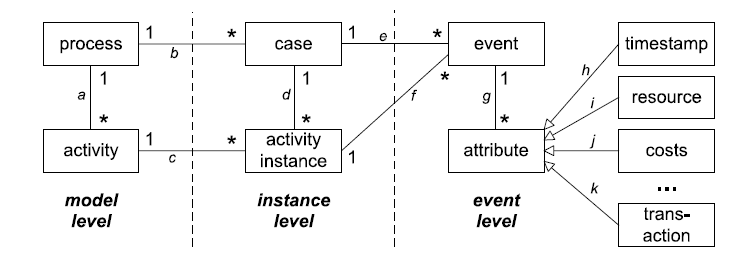

```{r creating_eventlogs, include = F}
library(tidyverse)
library(pander)
library(lubridate)
library(bupaR)
library(bslib)
```

```{r echo = F, out.width="25%", fig.align = "right"}
knitr::include_graphics("images/icons/create.PNG")
```

***

# Creating logs

Transforming your raw data into an event log object is one of the most challenging tasks in process analysis. On this page, we cover all the possible situations and challenges that you can encounter. 

We start with some important terminology:

-   **Case**: The _subject_ of your process, e.g. a customer, an order, a patient. 
-   **Activity**: A step in your process, e.g. receive order, sent payment, perform MRI SCAN, etc.
-   **Activity instance**: The execution of a specific step for a specific case. 
-   **Event**: A registration connected to an activity instance, characterized by a single timestamp. E.g. the _start_ of _Perform MRI SCAN_ for _Patient X_. 
-   **Resource**: A person or machine that is related to the execution of (part of) an activity instance. E.g. the radiologist in charge of our MRI SCAN. 
-   **Lifecycle status**: An indication of the status of an activity instance connect to an event. Typical values are _start_, _complete_. Other possible values are _schedule_, _suspend_, _resume_, etc. 
-   **Trace**: A sequence of activities. The activity instances that belong to a case will result to a specific trace when ordered by the time each instance occurred. 


## Logs: `eventlog` vs `activitylog`

`bupaR` supports two different kinds of log formats, both of which are an extension on R `data.frame`:

-   **`eventlog`**: Event logs are created from `data.frame` in which each row represents a single event. This means that it has a single timestamp.
-   **`activitylog`**: Activity logs are created from `data.frame` in which each row represents a single activity instances. This means it can has multiple timestamps, stored in different columns.

The data model below shows the difference between these two levels of observations, i.e. activity instances vs events.

```{r echo = F, out.width=800, fig.align = "center"}

```

The example below shows an excerpt of an event log containing 6 events. It can be seen that each event is linked to a single timestamp. As there can be more events within a single activity instance, each event also needs to be linked to a lifecycle status (here the registration_type). Furthermore, an activity instance identifier (handling_id) is needed to indicated which events belong to the same activity instances.

```{r echo = F}
patients %>%
	sample_n(size = 1) -> tmp

tmp %>%
	arrange(time) %>%
	as.data.frame() %>%
	slice(1:6) %>%
	select(-.order) %>%
	knitr::kable()
```

```{r echo = F, message = F, warning = F}
card("data-toggle" = "collapse", card_header(class = "card text-white bg-secondary mb-3", "Transactional lifecycle?"),
	 card_body("An event is an atomic registration related to an activity instance. It thus contains one (and only one) timestamp. Additionally, the event should include a reference to a lifecycle transition. More specifically, multiple events can describe different lifecycle transitions of a single activity instance. For example, one event might record when a surgery is scheduled, another when it is started, yet another when it is completed, etc."),
	 layout_column_wrap(width = "200px", 
			card_body("The standard transactional lifecycle."),card_image("images/transactional-lifecycle.PNG", container = card_body, width = "800px")), full_screen = TRUE)

```


The table below show the same data as above, but now using the `activitylog` format. It can be seen that there are now just 3 rows instead of 6, but each row as 2 timestamps, representing 2 events. The lifecycle status represented by those timestamps is now the column names of those variables. 

```{r echo = F}
tmp %>%
	to_activitylog() %>%
	arrange(start, complete) %>%
	as.data.frame() %>%
	slice(1:3) %>%
	select(-.order) %>%
	knitr::kable()
```

As these examples show, both formats can often be used for representing the same process data. However, there are some important differences between them:

-   the `eventlog` format has much more **flexibility** in terms of lifecycle. There is no limit to the number of events that can occur in a single activity instance. If your data contains lifecycle statuses such as *suspend*, *resume* or *reassign*, they can be recorded multiple times within a single activity instance. In the `activitylog` format, as each lifecycle gets is own column, it isn't possible to have two events of the same lifecycle status in a single activity instance.
-   the level of observation in an `eventlog` is an event. As a result, attribute values can be stored at the **event level**. In an `activitylog`, the level of observation is an activity instance. This means that all additional attributes that you have about your process should be at this higher level. For example, an activity instance can only be connected to a single resource in the `activitylog` format, whereas in an `eventlog` different events within the same activity instance can have different resources, of different values for any other attribute.
-   because of the limited flexibility, an `activitylog` is **easier** to make, and typically closer to the format that your data is already in (see further below on how to construct `log` objects). As a result of this, there are many situations in which the analysis of an `activitylog` will be much faster compared to `eventlog`, where a lot of additional complexity needs to be taken into account.

## The right log for the job

Functionalities in bupaR core packages support both formats. [^1] As such, the goal of your analysis does not impact the decision. Only the complexity of your data is important to make this decision. The precise format your raw data is in will further define the preparatory steps that are needed. We can distinguish between 3 typical scenarios. The flowchart below helps you on your way.

[^1]: Currently both `eventlog` and `activitylog` are supported by the packages `bupaR`, `edeaR` and `processmapR`. The `daqapo` package only supports `activitylog`, while all other packages only support `eventlog`. While the goal is to extend support for both to all packages, you can in the meanwhile always convert the format of your log using the functions `to_eventlog()` and `to_activitylog()`.

```{r echo = F, out.width = "100%"}
knitr::include_graphics("images/scenario.JPG")
```

An `activitylog` is the best option when each row in your data is an activity instance, or when events belonging to the same activity instance have equal attribute values (e.g. all events are executed by the same resource). When these two criteria do not hold, you can create an `eventlog` object.

### Scenario 1

If each row in your `data.frame` is already an activity instance, the `activitylog` format is the best way to go. Consider the data sample below.

```{r echo = F}
patients %>%
	sample_n(size = 1)%>%
	to_activitylog() %>%
	as.data.frame() %>%
	select(-employee, -handling_id, -.order) %>%
	select(patient, handling, start, everything()) %>%
	mutate(across(c(complete, start), as.character)) %>%
	rename(activity_started = start, activity_ended = complete) -> data
data %>%
	knitr::kable()
```

As each row contains multiple timestamps, i.e. activity_started and activity_ended, it is clear that each row represents an activity instance. Turning this dataset in an `activitylog` requires the following steps:

1.  Timestamp variables should be named in correspondence with the standard Transactional lifecycle.
2.  Timestamp variables should be of type `Date` or `POSIXct`.
3.  Use the `activitylog` constructor function.

```{r}
data %>%
	# rename timestamp variables appropriately
	dplyr::rename(start = activity_started, 
		   complete = activity_ended) %>%
	# convert timestamps to 
	convert_timestamps(columns = c("start", "complete"), format = ymd_hms) %>%
	activitylog(case_id = "patient",
				activity_id = "handling",
				timestamps = c("start", "complete"))
	
```

Note that in case a resource identifier is available, this information can be added in the `activitylog` call.

### Scenario 2

If each row in your `data.frame` is an event, but all events that belong to the same activity instance share the same attribute values, the `activitylog` format is again the best way to go. Consider the data sample below.

```{r echo = F}
patients %>%
	sample_n(size = 1)%>%
	as.data.frame() %>%
	select(-.order) %>%
	select(patient, handling, everything()) %>%
	arrange(time) %>%
	mutate(time = as.character(time)) %>%
	mutate(registration_type = fct_recode(registration_type, "started" = "start", "completed" = "complete")) -> data
data %>%
	knitr::kable()
```

The resource identifier (employee) has been added as an additional attribute. Note that though each row is an event, they can be grouped into activity instances using the handling_id column, which we will call the activity instance id. Using the latter, we can see that the resource attribute is the same within each activity instance, which allows us to create an `activitylog`. The steps to do so are the following.

1.  Lifecycle variable should be named in correspondence with the standard Transactional lifecycle.
2.  Timestamp variable should be of type `Date` or `POSIXct`.
3.  Use the `eventlog` constructor function.
4.  Convert to `activitylog` using `to_activitylog` for reduced memory usage and improved performance.

```{r}
data %>%
	# recode lifecycle variable appropriately
	dplyr::mutate(registration_type = forcats::fct_recode(registration_type, 
														  "start" = "started",
														  "complete" = "completed")) %>%
	convert_timestamps(columns = "time", format = ymd_hms) %>%
	eventlog(case_id = "patient",
				activity_id = "handling",
				activity_instance_id = "handling_id",
				lifecycle_id = "registration_type",
				timestamp = "time",
				resource_id = "employee") %>%
	to_activitylog() -> tmp_act
```

Note that the resource identifier is optional, and can be left out of the `eventlog` call if such an attribute does not exist in your data. If the activity instance id does not exist, some heuristics are available to generate it: [Missing activity instance identifier].

### Scenario 3

If each row is an event, and events of the same activity instance have differing attribute values, the flexibility of `eventlog` objects is required. Consider the data sample below.

```{r echo = F}
patients %>%
	sample_n(size = 1)%>%
	as.data.frame() %>%
	select(-.order) %>%
	select(patient, handling, everything()) %>%
	arrange(time) %>%
	mutate(time = as.character(time)) %>%
	mutate(employee = sample(employee)) %>%
	mutate(registration_type = fct_recode(registration_type, "started" = "start", "completed" = "complete")) -> data
data %>%
	knitr::kable()
```

In this example, different resources (employees) sometimes perform the start and complete event of the same activity instance. Therefore, we resort to the `eventlog` format which has no problems storing this. The steps to take are the following:

1.  Lifecycle variable should be named in correspondence with the standard Transactional lifecycle.
2.  Timestamp variable should be of type `Date` or `POSIXct`.
3.  Use the `eventlog` constructor function.

```{r}
data %>%
	# recode lifecycle variable appropriately
	dplyr::mutate(registration_type = forcats::fct_recode(registration_type, 
														  "start" = "started",
														  "complete" = "completed")) %>%
	convert_timestamps(columns = "time", format = ymd_hms) %>%
	eventlog(case_id = "patient",
				activity_id = "handling",
				activity_instance_id = "handling_id",
				lifecycle_id = "registration_type",
				timestamp = "time",
				resource_id = "employee") 
```

Note that we need an `eventlog` irrespective of which attribute values are differing, i.e. it can be resources, but also any additional variables you have in your data set. For the special case of resource values, it might be that a different resource executing events in the same activity instance is a data quality issue. If so, some functions can help you to identify this issue: [Inconsistent Resources].

Again, if the activity instance id does not exist, some heuristics are available to generate it: [Missing activity instance identifier].

## Typical problems

### Missing activity instance id

In order to be able to correlate events which belong to the same activity instance, an activity instance identifier is required. For example, in the data shown below, it is possible that a patient has gone through different surgeries, each with their own start- and complete event. The activity instance identifier will then allow to distinguish which events belong together and which do not. It is important to note that this instance identifier should be unique, also among different cases and activities.

```{r echo = F}
tribble(~patient, ~activity, ~timestamp, ~status, ~activity_instance,
		"John Doe","check-in", "20170510 083326", "complete", 0001,
		"John Doe","surgery", "20170510 085316", "start", 0002,
		"John Doe","surgery", "20170510 092519", "complete", 0002,
		"John Doe","treatment","20170510 100125", "start", 0003,
		"John Doe","treatment","20170510 103518", "complete", 0003,
		"John Doe","surgery", "20170510 104135", "start",0004,
		"John Doe","surgery", "20170510 110556", "complete", 0004,
		"John Doe","check-out", "20170511 145236", "complete", 0005) %>% 
	mutate(timestamp = ymd_hms(timestamp)) -> data

data %>% knitr::kable()
```

If the activity instance identifier is not available you can use the `assign_instance_id()` function, which uses an heuristic to create the missing identifier. Alternatively, you can try to create the identifier on your own using `dplyr::mutate()` and other manipulation functions.

### Large Datasets and Validation

By default, `bupaR` validates certain properties of the activity instances that is supplied when creating an event log:

-   a single activity instance identifier must not be connected to multiple cases,
-   a single activity instance identifier must not be connected to multiple activity labels,

However, these checks are not efficient and may lead to considerable performance issues for large data frames. It is possible to deactivate the validation in case you already know that your data fulfills all the requirements, using the argument `validate = FALSE` when creating the `eventlog`. Note that when the activity instance id was created with the `assign_instance_id()` function, you can assume the above properties hold.

### Inconsistent Resources

Each event can contain the notion of a resource. It can be so that different events belonging to the same activity instance are executed by different resources, as in the `eventlog` below.

```{r echo = F, warning = F}
patients %>%
	sample_n(size = 1)%>%
	as.data.frame() %>%
	select(-.order) %>%
	select(patient, handling, everything()) %>%
	arrange(time) %>%
	mutate(time = as.character(time)) %>%
	mutate(employee = sample(employee)) %>%
	mutate(registration_type = fct_recode(registration_type, "started" = "start", "completed" = "complete")) -> data
data %>%
	# recode lifecycle variable appropriately
	dplyr::mutate(registration_type = forcats::fct_recode(registration_type, 
														  "start" = "started",
														  "complete" = "completed")) %>%
	convert_timestamps(columns = "time", format = ymd_hms) %>%
	eventlog(case_id = "patient",
				activity_id = "handling",
				activity_instance_id = "handling_id",
				lifecycle_id = "registration_type",
				timestamp = "time",
				resource_id = "employee") -> log

log %>%
	knitr::kable()
```

If you have a large dataset, and want to have an overview of the activity instances that have more than one resource connected to them, you can use the `detect_resource_inconsistences()` function.

```{r}
log %>%
	detect_resource_inconsistencies()
```

If you want to remove these inconsistencies, a quick fix is to merge the resource labels together with `fix_resource_inconsistencies()`. Note that this is not needed for `eventlog`, but it is for `activitylog`. While the creation of the `eventlog` will emit a warning when resource inconsistencies exist, this should mostly be seen as a data quality warning. That said, there might be analysis related to the counting of resources where such inconsistencies might lead to odd results.

```{r}
log %>%
	fix_resource_inconsistencies()
```


```{r footer, results = "asis", echo = F}
CURRENT_PAGE <-  str_replace(knitr::current_input(), ".Rmd",".html")
res <- knitr::knit_expand("_button_footer.Rmd", quiet = TRUE)
res <- knitr::knit_child(text = unlist(res), quiet = TRUE)
cat(res, sep = '\n')
```


