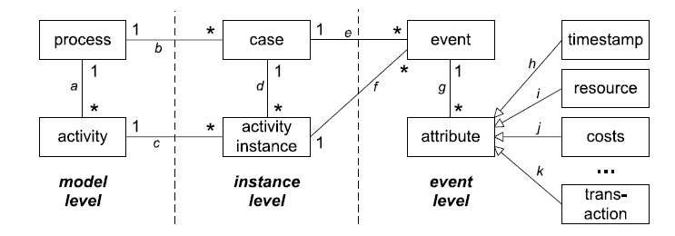
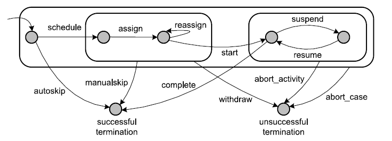

```{r include = F}
library(tidyverse)
library(pander)
library(lubridate)
```
```{r echo = F}
htmltools::includeHTML("tracking_google_analytics.html")
```
This page will guide you in creating their own event log objects. Firstly, the data model for events is introduced. Secondly, it is shown how to create `eventlog` objects. Finally, some common examples of data transformations are shown which might be useful for reshaping event data.

## Event data model

The notion of event log in bupaR refers to a set of events which are recorded in the context of a process. For instance, suppose the process under consideration takes place in the emergency department of a hospital. A general representation of the data model is shown below. Firstly, each event belongs to a case. A case, in general is an instance of the process. In the emergency department example, a case would be a visit by a patient. 


```{r echo = F, out.width=800, fig.align = "center"}

```


### Activities and activity instances

Each event relates to the coarser concept of an activity. For instance, activities in our example might be: _check-in_,  _surgery_, _treatment_, etc. When an activity is performed, this means that an _activity instance_ is created. While the label _surgery_ refers to an activity, one specific surgery for a specific patient at a specific point in time is an activity instance. 

```{r echo = F}
tribble(~patient, ~activity, 
		"John Doe","check-in",
		"John Doe","surgery",
		"John Doe","treatment",
		"John Doe","surgery",
		"John Doe","check-out") %>% pander
```

The table above shows a fictious example of a patient which went through 4 different activities. Note that there are 5 different activity instances, as there were two instances of the "surgery" activity. 

### Transactional life cycle

An event is an atomic registration related to an activity instance. It thus contains one (and only one) timestamp. Additionally, the event should include a reference to a life cycle transition. More specificaly, multiple events can describe different life cycle transitions of a single activity instance. For example, one event might record when a surgery is scheduled, another when it is started, yet another when it is completed, etc. The Figure shows the standard transactional life cycle. While it supports a wide variety of transaction life cycle stages, the user is allowed to defined his/her own life cycle transitions.

```{r transactional_lifecycle, echo = F, out.width=800, fig.align = "center", fig.cap = "Standard transactional life cycle."}

```

In the table below, the earlier example is extended: for each activity instance, different statusses of the transactional life cycle can be seen, each of them with there own timestamp. At this point, each row refers to a single specific event. Note that not all activity instances have the same life cycle transations, and even different instances of the same activity might have different recorded transitions. E.g. in contrast with the first surgery, the second started without being scheduled, probably due to reasons of urgency.

```{r echo = F}
tribble(~patient, ~activity, ~timestamp, ~status,
		"John Doe","check-in", "20170510 083326", "complete",
		"John Doe","surgery", "20170510 083821", "schedule",
		"John Doe","surgery", "20170510 085316", "start",
		"John Doe","surgery", "20170510 092519", "complete",
		"John Doe","treatment","20170510 100125", "start",
		"John Doe","treatment","20170510 103518", "complete",
		"John Doe","surgery", "20170510 104135", "start",
		"John Doe","surgery", "20170510 110556", "complete",
		"John Doe","check-out", "20170511 145236", "complete") %>% 
	mutate(timestamp = ymd_hms(timestamp)) %>% pander()
```

In order to be able to correlate events which belong to the same activity instance, an activity instance identifier is required. For example, it is possible that a patient has gone through different surgeries, each with there own scheduled, started and complete event. The activity instance identifier will then allow to distinguish which events belong together and which not. The activity instance identifier is always required and will be very important in case of concurrent activity instances. In the table below, the event-activity instance correlation is formally defined by the activity_instance column. It is important to note that this instance identifier should be unique, also among different cases and activities.

```{r echo = F}
tribble(~patient, ~activity, ~timestamp, ~status, ~activity_instance,
		"John Doe","check-in", "20170510 083326", "complete", 0001,
		"John Doe","surgery", "20170510 083821", "schedule", 0002,
		"John Doe","surgery", "20170510 085316", "start", 0002,
		"John Doe","surgery", "20170510 092519", "complete", 0002,
		"John Doe","treatment","20170510 100125", "start", 0003,
		"John Doe","treatment","20170510 103518", "complete", 0003,
		"John Doe","surgery", "20170510 104135", "start",0004,
		"John Doe","surgery", "20170510 110556", "complete", 0004,
		"John Doe","check-out", "20170511 145236", "complete", 0005) %>% 
	mutate(timestamp = ymd_hms(timestamp)) %>% knitr::kable()
```

### Resources

Finally, each event can also contain the notion of a resource. For instance, the adminstrative clerk that checked-in a patient or scheduled its surgery, or the docter which performed a treatment.

```{r echo = F}
tribble(~patient, ~activity, ~timestamp, ~status, ~activity_instance, ~resource,
		"John Doe","check-in", "20170510 083326", "complete", 0001, "Samantha",
		"John Doe","surgery", "20170510 083821", "schedule", 0002, "Danny",
		"John Doe","surgery", "20170510 085316", "start", 0002, "Richard",
		"John Doe","surgery", "20170510 092519", "complete", 0002,"Richard",
		"John Doe","treatment","20170510 100125", "start", 0003, "Danny",
		"John Doe","treatment","20170510 103518", "complete", 0003, "Danny",
		"John Doe","surgery", "20170510 104135", "start",0004, "William",
		"John Doe","surgery", "20170510 110556", "complete", 0004, "William",
		"John Doe","check-out", "20170511 145236", "complete", 0005, "Samantha") %>% 
	mutate(timestamp = ymd_hms(timestamp)) -> example_log_1

#xesreadR::write_xes(example_log_1, "data/example_log_1.xes")
write_csv(example_log_1, "data/example_log_1.csv")

example_log_1 %>% knitr::kable()
```


To sum up, each row in the data should be an event with at least 6 different pieces of required information:

*	a timestamp
*	a case identifier
*	an activity label
*	a activity instance identifier
*	a transactional life cycle stage	
*	a resource identifier

Additionally, any number of custom event attributes can be addedn e.g. cost.

## The event log object

Given that the data is in the format discussed above and stored as a data.frame `example_log_1`, an event log object can be created with the `eventlog` function from `bupaR` as shown below.

```{r, include = F}
library(bupaR)
example_log_1 %>% #a data.frame with the information in the table above
	eventlog(
		case_id = "patient",
		activity_id = "activity",
		activity_instance_id = "activity_instance",
		lifecycle_id = "status",
		timestamp = "timestamp",
		resource_id = "resource"
	)

```

```{r, include = F}
example_log_1 %>% #a data.frame with the information in the table above
	eventlog(
		case_id = "patient",
		activity_id = "activity",
		activity_instance_id = "activity_instance",
		lifecycle_id = "status",
		timestamp = "timestamp",
		resource_id = "resource"
	) -> log
write_xes(log, "data/example_log_1.xes")

```

The example datasets used can be found [here](https://github.com/bupaverse/website/tree/master/data)

### Large Datasets and Validation

By default bupaR validates certain properties of the data frame that is supplied when creating an event log:

* a single activity instance identifier must not be connected to multiple cases,
* a single activity instance identifier must not be connected to multiple activity labels,
* a single activity instance identifier must not be connected to multiple resources.

However, these checks are not efficient and may lead to considerable performance issues for large data frames. It is possible to deactivate the validation in case you already know that your data fulfills all the requirements:

```{r, include = F}
example_log_1 %>% #a data.frame with the information in the table above
	eventlog(
		case_id = "patient",
		activity_id = "activity",
		activity_instance_id = "activity_instance",
		lifecycle_id = "status",
		timestamp = "timestamp",
		resource_id = "resource",
		validate = FALSE
	) -> log
```


## Common transformations

Often, data will not come in the format defined above, or will not include all the required values. Below are given a few examples and how to handle them.

### Lack of transitional lifecycle

It happens a lot that data is not recorded at the low level of transactions, but that only a single timestamp is recorded for each activity instance. In that case, an event is _equivalent_ to a activity instance. For instance, consider the example above, but now we only have the following information.

```{r, include = F}
tribble(~patient, ~activity, ~timestamp, ~resource,
		"John Doe","check-in", "20170510 083326", "Samantha",
		"John Doe","surgery", "20170510 092519", "Richard",
		"John Doe","treatment","20170510 103518",  "Danny",
		"John Doe","surgery", "20170510 110556",  "William",
		"John Doe","check-out", "20170511 145236", "Samantha") %>% 
	mutate(timestamp = ymd_hms(timestamp)) -> example_log_2

write_csv(example_log_2, "data/example_log_2.csv")
```
```{r}
example_log_2
```

When this is the case, it requires domain knowledge to know which transition of the life cycle is recorded. However, most of the time it will be the completion of a task which is recorded. A such, the lifecycle transition can be added manually, as well as the activity instance id, which is unique for each row.

```{r}
example_log_2 %>%
	mutate(status = "complete",
		   activity_instance = 1:nrow(.)) %>%
	eventlog(
		case_id = "patient",
		activity_id = "activity",
		activity_instance_id = "activity_instance",
		lifecycle_id = "status",
		timestamp = "timestamp",
		resource_id = "resource"
	)
```

```{r, include = F}
example_log_2 %>%
	mutate(status = "complete",
		   activity_instance = 1:nrow(.)) %>%
	eventlog(
		case_id = "patient",
		activity_id = "activity",
		activity_instance_id = "activity_instance",
		lifecycle_id = "status",
		timestamp = "timestamp",
		resource_id = "resource"
	) -> log
write_xes(log, "data/example_log_2.xes")

```


### Lack of resources

Since many of the functions in bupaR are targetted towards organizational and performance issues, they expect the presence of the resource attribute. However, in certain cases, this information will no be available, such as for the data in `example_log_3`.

```{r, include = F}
tribble(~patient, ~activity, ~timestamp, ~status, ~activity_instance,
		"John Doe","check-in", "20170510 083326", "complete", 0001, 
		"John Doe","surgery", "20170510 083821", "schedule", 0002, 
		"John Doe","surgery", "20170510 085316", "start", 0002, 
		"John Doe","surgery", "20170510 092519", "complete", 0002,
		"John Doe","treatment","20170510 100125", "start", 0003, 
		"John Doe","treatment","20170510 103518", "complete", 0003, 
		"John Doe","surgery", "20170510 104135", "start",0004,
		"John Doe","surgery", "20170510 110556", "complete", 0004, 
		"John Doe","check-out", "20170511 145236", "complete", 0005) %>% 
	mutate(timestamp = ymd_hms(timestamp)) -> example_log_3
write_csv(example_log_3, "data/example_log_3.csv")

```
```{r}
example_log_3
```

In order to work around this problem, the easiest solution is to include an empty resource variable.

```{r}
example_log_3 %>%
	mutate(resource = NA) %>%
		eventlog(
		case_id = "patient",
		activity_id = "activity",
		activity_instance_id = "activity_instance",
		lifecycle_id = "status",
		timestamp = "timestamp",
		resource_id = "resource"
	)
```

```{r, include = F}
example_log_3 %>%
	mutate(resource = NA) %>%
		eventlog(
		case_id = "patient",
		activity_id = "activity",
		activity_instance_id = "activity_instance",
		lifecycle_id = "status",
		timestamp = "timestamp",
		resource_id = "resource"
	) -> log
write_xes(log, "data/example_log_3.xes")
```


### Activity log

Another possibity is that instead of a list of events, there is a list of activity instances available. This is the case in `example_log_4`.

```{r, include = F}
example_log_1 %>%
	select(-resource) %>%
	tidyr::spread(status, timestamp) %>%
	select(-activity_instance) %>%
	select(patient, activity, schedule, start, complete) -> example_log_4
write_csv(example_log_4, "data/example_log_4.csv")

```

```{r}
example_log_4
```

When this is the case, we proceed by first adding an unique id to define the activity instances, and subsequently by gathering the different timestamp columns using `tidyr::gather`.

```{r}
example_log_4 %>%
	mutate(activity_instance = 1:nrow(.)) %>%
	gather(status, timestamp, schedule, start, complete)  %>%
	mutate(resource = NA) %>%
	filter(!is.na(timestamp)) %>%
	eventlog(
		case_id = "patient",
		activity_id = "activity",
		activity_instance_id = "activity_instance",
		lifecycle_id = "status",
		timestamp = "timestamp",
		resource_id = "resource"
	)
```

```{r, include = F}
example_log_4 %>%
	mutate(activity_instance = 1:nrow(.)) %>%
	gather(status, timestamp, schedule, start, complete)  %>%
	mutate(resource = NA) %>%
	filter(!is.na(timestamp)) %>%
	eventlog(
		case_id = "patient",
		activity_id = "activity",
		activity_instance_id = "activity_instance",
		lifecycle_id = "status",
		timestamp = "timestamp",
		resource_id = "resource"
	) -> log

write_xes(log, "data/example_log_4.xes")
```


