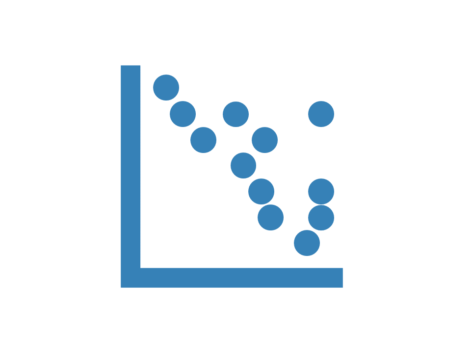

```{r echo = F, out.width="25%", fig.align = "right"}

```

***

```{r include = F}
library(tidyverse)
library(bupaR)
library(pander)
library(lubridate)
```

Dotted charts can be made with the `dotted_chart` function. A dotted chart is a graph in which each activity instance is displayed with a point. The x-axis referce to the time aspect, while the y-axis refers to cases. The dotted chart function has 3 arguments

* x: Either absolute (absolute time on x-axis) or relative (time difference since start case on x-axis)
* y: The ordering of the cases along the y-axis: by start, end, or duration.
* color: The attribute used to color the activity instances. Default to the activity type.

Below, you can see some examples for dotted charts with various configurations

```{r}
patients %>%
	dotted_chart(x = "absolute", sort = "start")
patients %>%
	dotted_chart(x = "absolute", sort = "start", color = "employee")
patients %>%
	dotted_chart(x = "relative", sort = "duration", color = "employee")
```


```{r footer, results = "asis", echo = F}
CURRENT_PAGE <-  stringr::str_replace(knitr::current_input(), ".Rmd",".html")
res <- knitr::knit_expand("_button_footer.Rmd", quiet = TRUE)
res <- knitr::knit_child(text = unlist(res), quiet = TRUE)
cat(res, sep = '\n')
```

