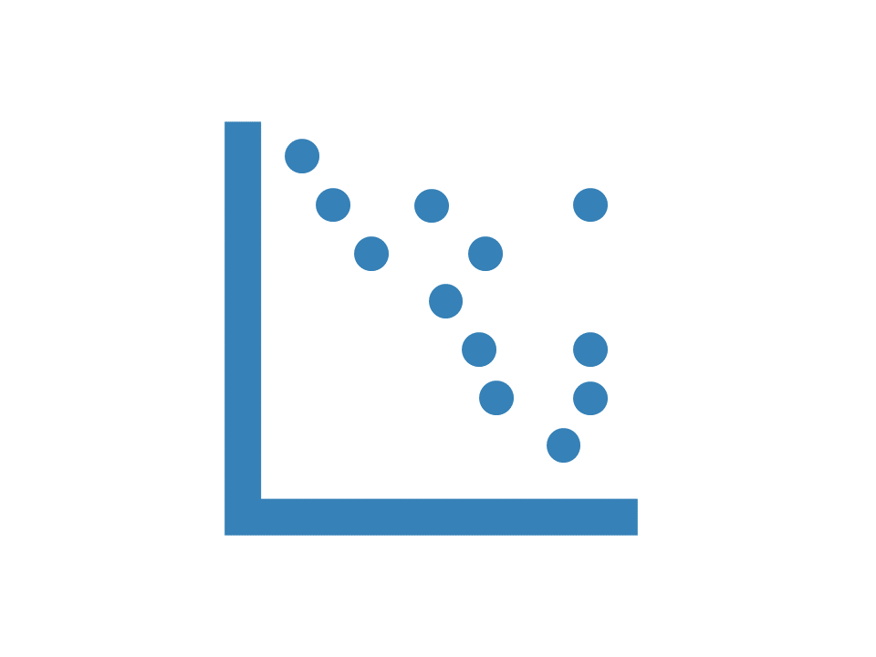

```{r echo = F, out.width="25%", fig.align = "right"}

```

***

# Dotted chart {.tabset .tabset-pills}

```{r include = F}
library(bupaverse)
knitr::opts_chunk$set(out.width = "80%", fig.asp = 0.6)
```

```{r eval = F}
library(bupaverse)
```

Dotted charts can be made with `dotted_chart()`. A dotted chart is a graph in which each activity instance is displayed with by a dot. The x-axis refers to the time aspect, while the y-axis refers to cases. The dotted chart function has 3 arguments.

* __x__: 
	* absolute: absolute time on x-axis
	* relative: time difference since start case on x-axis
	* relative_day: time difference since start of day on x-axis (00:00)
	* relative_week: time difference since start of week on x-axis (Mondag 00:00)
* __sort__: The ordering of the cases along the y-axis: _start_, _end_, _duration_, _start_day_, or _start_week._ Value _auto_ (default) will set sort appropriately given the argument for `x`
* __color__: The attribute used to color the activity instances. Defaults to the activity type.

Below, you can see some examples for dotted charts with various configurations

## Absolute
<div class = "blue">
```{r}
sepsis %>%
	dotted_chart(x = "absolute")
sepsis %>%
	dotted_chart(x = "absolute", sort = "end")
```
</div>

## Relative
<div class = "blue">
```{r}
sepsis %>%
	dotted_chart(x = "relative")
```
</div>

## Relative day
<div class = "blue">
```{r}
sepsis %>%
	dotted_chart(x = "relative_day")
```

</div>
## Relative week 

<div class = "blue">

```{r}
sepsis %>%
	dotted_chart(x = "relative_week")
```
</div>
# {.unlisted .unnumbered}

Other configurations: 

* change the used color scale by configuring the `scale_color` argument

```{r}
sepsis %>%
	dotted_chart(x = "relative_week",
				 scale_color = ggplot2::scale_color_discrete)
```


```{r footer, results = "asis", echo = F}
CURRENT_PAGE <-  stringr::str_replace(knitr::current_input(), ".Rmd",".html")
res <- knitr::knit_expand("_button_footer.Rmd", quiet = TRUE)
res <- knitr::knit_child(text = unlist(res), quiet = TRUE)
cat(res, sep = '\n')
```

