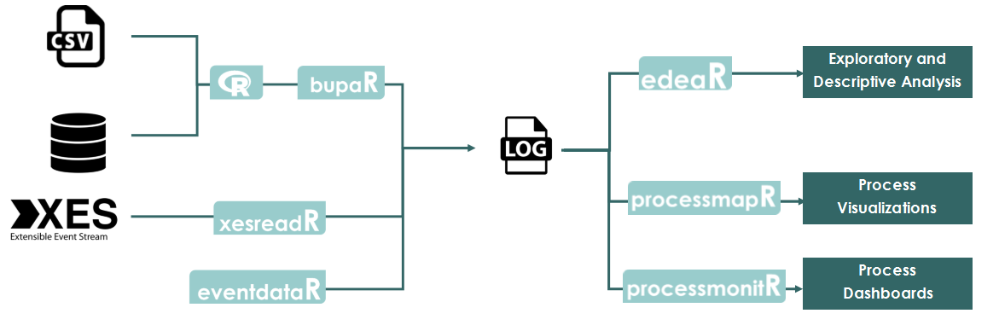
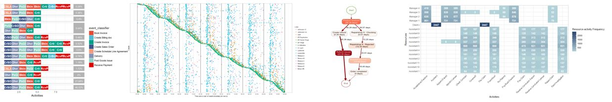
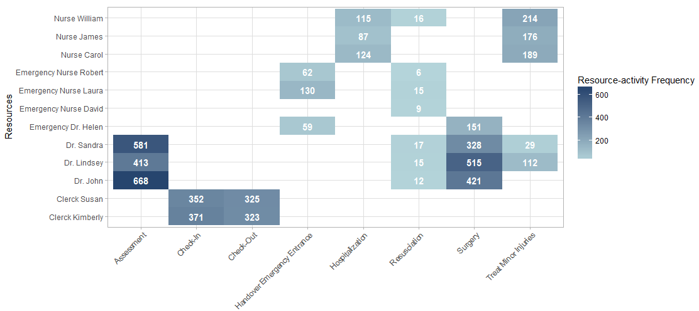
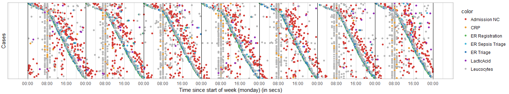
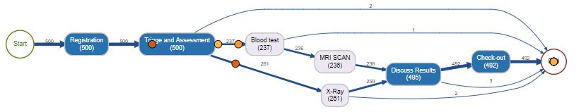

```{r include = F}
library(htmltools)
thumbnail <- function(title, img, href, caption = F) {
  div(class = "col-sm-3",
      a(class = "thumbnail", title = title, href = href,
        img(src = img),
        div(class = ifelse(caption, "caption", ""),
          ifelse(caption, title, "")
        )
      )
  )
}
```

```{r echo = F}
htmltools::includeHTML("tracking_google_analytics.html")
```

```{r echo = F, fig.align = "right", out.width=400}

```


**`bupaR`** is an open-source, integrated suite of R-packages for the handling and analysis of business process data. It currently consists of 8 packages, including the central package, supporting different stages of a process mining workflow. 

<br/>

```{r echo = F, eval = F, fig.align = "center", out.width=700}

```	

```{r echo = F, fig.align="center", out.width = 900}

```


**`bupaR`** provides support for different stages in process analysis, such as importing event data, calculating descriptives, process monitoring and process visualization. The central package, **`bupaR`** includes basic functionality for creating event log objects in R. It contains several functions to get information about an event log and also provides specific event log versions of generic R functions.

## Packages

| Package | Description
|---------------|---------------------------------------------------------------|
| `bupaR` | The `bupaR`-package is the core package of the framework, implements an S3-objects class for event data. It provides functions to create these objects, as well as support for common transformations. Auxiliary functions to seamlessly change  the classifiers of the event data are made available, and event log versions of common `dplyr` functions for data manipulation are implemented, such as `filter`, `group_by` and `mutate`, among others. These functions can be used to preprocess event data. Some specific preprocessing tasks are supported explicitly by specific functions, such as aggregations of activity labels. |
| | [**Read more**](creating_eventlogs.html) |
| | |
| `edeaR` | `edeaR`  stands for Exploratory and Descriptive Event-Data Analyses, and contains a set of process metrics to describe and explore event logs. The process metrics are based on Lean Six Sigma literature  and can be analyzed and visualized at different levels of granularity. Additionally, `edeaR` contains an extensive collection of event data specific filters.|<!--| |  |-->
| | [**Read more**](exploring.html) |
| | |
| `eventdataR` | `eventdataR` is a data-package which provide easy access to event logs for testing and experiments. Currently, both artificial event data, e.g. `patients`, as well as real-life event data, such as the `sepsis` dataset.
| | [**Read more**](eventdataR.html) |
| | |
| `xesreadR` | In order to be compatible with teh eXtensible Event Stram IEEE standard, the `xesreadR` package allows to read and write .xes-files.|<!--| |  |-->
| | [**Read more**](read_xes.html) |
| | |
| `processmapR` | Process data specific visualizations, such as process maps and dotted charts, are provided by `processmapR`. The provided visualizations are highly customizable and can be used to give insights to different aspects of the process. |<!--| |  | -->
| | [**Read more**](processmaps.html) |
| | |
| `processanimateR` | As an extension of `processmapR`, `processanimateR` allows to easily animate process maps using token replay. |<!--| |  |-->
| | [**Read more**](https://fmannhardt.github.io/processanimateR/) |
| | |
| `petrinetR` | While most package of `bupaR` are focused on process data, `petrinetR` is the first package to introduce a process model notation in R. Currently, it supports the creation of Petri Nets, as well as reading and writing .PMNL-files. Furthermore, Petri Nets can be visualized, adjusted and one can perform manual token replay and parse transition sequences. |
| | [**Read more**](https://gertjanssenswillen.github.io/petrinetR/) |
| | |
| `processmonitR` |  `processmonitR` provides a limited set of process dashboards. These can be used in a permanent, real-time fashion, as well as for interactive data analysis. |
| | [**Read more**](processmonitR.html) |
| | |


