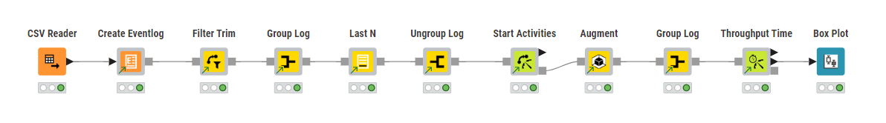
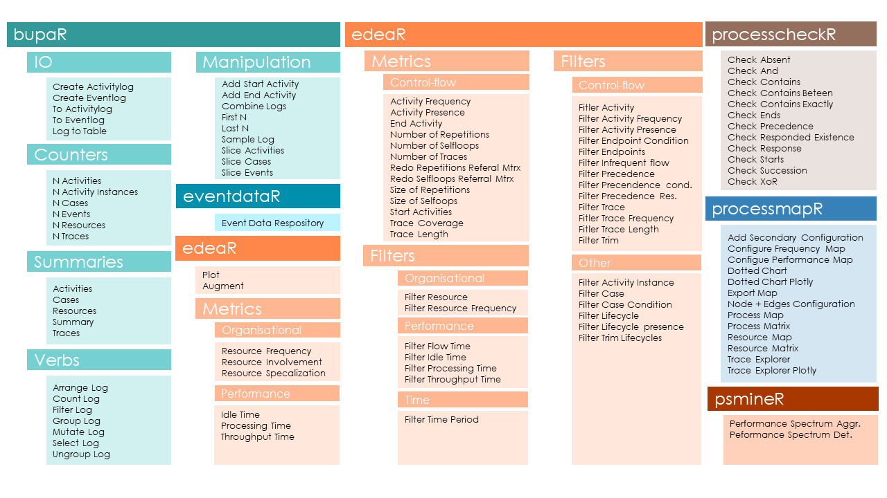
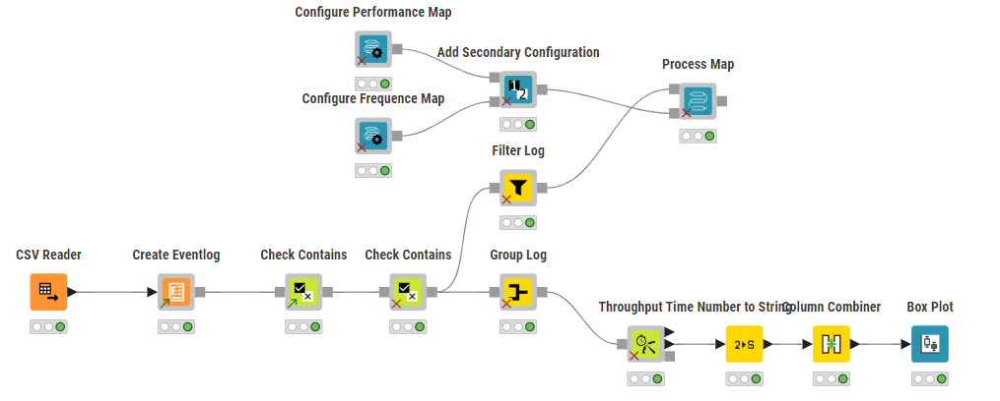

	
<br/> 

```{r echo = F, out.width="25%", fig.align = "right"}
knitr::include_graphics("images/bupaRknime.PNG")

```
	
***

```{r echo = F, out.width = "100%"}

```
	
bupaR4KNIME consists of 100+ _linked components_ that you can use in any KNIME workflow for process analysis. All components can be used by drag-and-dropping them from the [KNIME Hub](https://hub.knime.com/biaru%20-%20digital%20future%20lab/spaces/bupaverse/~t28tTZVSURAYtGLg/) or exporting and importing them in your KNIME project. 

The nodes are organized following the originating `bupaR`-packages: `bupaR`, `edeaR`, `eventdataR`, `processcheckR`, `processmapR` and `psmineR`. Within each package they are futher organised according to the family of functionality. The entire break down looks as follows: 

* bupaR
	* Counters
	* Helpers
	* IO
	* Manipulation
	* Summaries
	* Verbs
* edeaR
	* Filters
		* Control-flow
		* Organisational
		* Performance
		* Time
		* Other
	* Metrics
		* Control-flow
		* Organisational
		* Performance
 * processcheckR	
 * processmapR
 * psmineR
 
 The full list of linked components in this structure is shown below.
 
```{r echo = F, out.width = "100%"}

```

Using the bupaR components in combination with KNIME node, you can build many flexible process analysis workflows. The following workflow a) performs rule-based conformance checking (left) and uses the results to b) show deviating behaviour in a process map (top) while also c) comparing throughput time for different conformance-based groups, visualizing the results with a KNIME boxplot (right). 
 
```{r echo = F, out.width = "100%"}

```
 
A comprehensive introduction to all components and their usage can be found [here](images/bupaR 4 KNIME - manual.pdf) (pdf, 4.1 MB).


<center><p style = "font-size: 12px">KNIME® and the KNIME logo are trademarks of KNIME AG. This website and the described extension are not affiliated with, endorsed by, or sponsored by KNIME AG.</p></center>

	