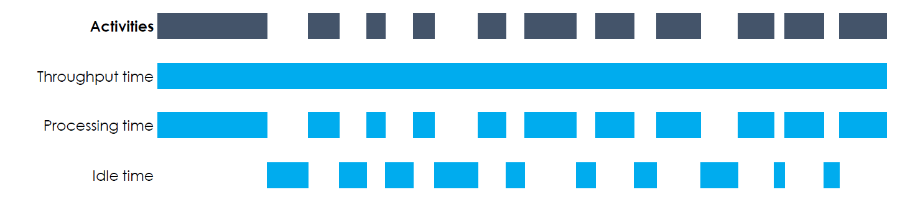

```{r echo = F, out.width="25%", fig.align = "right"}

```

```{r include = F}
library(bupaR)
```

***

# Performance analysis

Three different time metrics can be computed:

*	throughput time: the time between the very first event of the case and the very last
*	processing time: the sum of the duration of all activity instances
*	idle time: the time when no activity instance is active

The duration of an activity instance is the time between the first and the last event related to that activity instance. In case several activity instances within a case overlap, processing time for that overlap will be counted twice. The figure below shows a schematic overview of different time metrics. 

```{r echo = F}

```


## Idle Time

The idle time is the time that there is no activity in a case or for a resource. It can only be calculated when there are both start and end timestamps available for activity instances. It can be computed at the levels trace, resource, case and log, and using different time units.

```{r}
patients %>%
	idle_time("resource", units = "days")
```

The output of __all__ metrics in edeaR can be visualized by supplying it to the plot function.

```{r}
patients %>%
	idle_time("resource", units = "days") %>%
	plot()
```

## Processing Time

The processing time can be computed at the levels log, trace, case, activity and resource-activity. It can only be calculated when there are both start and end timestamps available for activity instances.

```{r}
patients %>% 
	processing_time("activity") %>%
	plot
```

## Throughput Time

The throughput time is the time form the very first event to the last event of a case. The levels at which it can be computed are log, trace, or case.

```{r}
patients %>%
	throughput_time("log") %>%
	plot()
```