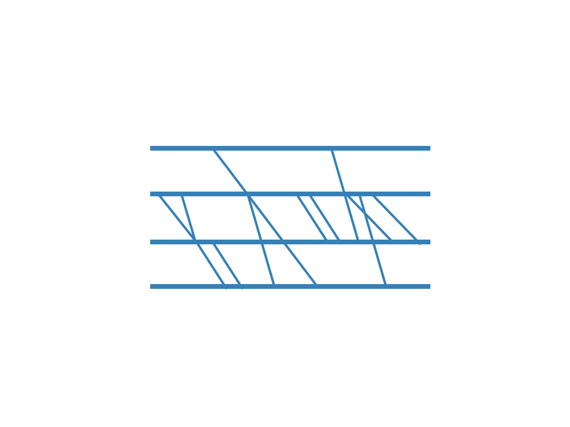

```{r echo = F, out.width="25%", fig.align = "right"}

```

***
```{r creating_eventlogs, include = F}
library(tidyverse)
library(pander)
library(lubridate)
library(bupaR)
library(psmineR)
```


The `psmineR` packages supports both detailed and aggregated performance spectra, as described in Denisov, V., Fahland, D., & van der Aalst, W. M. P. (2018) doi:10.1007/978-3-319-98648-7_9. The can be created using `ps_detailed` and `ps_aggregated`, respectively.


## Detailed performance spectrum

```{r}
traffic_fines %>%
	ps_detailed()
```

The number of segments shown in the performance spectrum can be configured in two ways. The first is to explicitly state the number of segments to show.

```{r}
traffic_fines %>%
	ps_detailed(n_segments = 10)
```

Alternatively, one can state a `segment_coverage`. This is a value between 0 and 1 that indicates the percentage of cases in which each segment must be present in order to be visualized. A value of 0.2 is the default used when neither `n_segments` or `segment_coverage` are defined. 

By default, the colors in the performance spectrum will relate to lead time quartiles, the longest instances colored in red, while the shortest are colored in blue. Using the `classification` argument, any available attribute can be used for coloring. For example, the resource, as shown below. 

```{r}
traffic_fines %>%
	ps_detailed(classification = "resource")
```

Note that when another color classification is used, the built-in bupaR color scale will be used. As the resource in the case of traffic_fines is not very insightful, below we show a slightly more advanced version, where we use log augmentation incorporate the end activity of the case.

```{r}
traffic_fines %>%
	end_activities("case") %>%
	augment(traffic_fines, prefix = "end") %>%
	ps_detailed(classification = "end_activity")
```

Changing the color classification can also be done implicitly, by grouping the log on the classification variable. 

```{r}
traffic_fines %>%
	end_activities("case") %>%
	augment(traffic_fines, prefix = "end") %>%
	group_by(end_activity) %>%
	ps_detailed()
```

## Aggregated performance spectrum

The aggregated performance spectrum works in completely the same way. 

```{r}
traffic_fines %>%
	end_activities("case") %>%
	augment(traffic_fines, prefix = "end") %>%
	group_by(end_activity) %>%
	ps_aggregated()
```

It does have 2 more configuration options: the number of bins to be used (default 30), and the grouping to be used (which can be based on "start" or "complete"). Details on the latter can be found in the original paper describing the performance spectrum. 


```{r footer, results = "asis", echo = F}
CURRENT_PAGE <-  stringr::str_replace(knitr::current_input(), ".Rmd",".html")
res <- knitr::knit_expand("_button_footer.Rmd", quiet = TRUE)
res <- knitr::knit_child(text = unlist(res), quiet = TRUE)
cat(res, sep = '\n')
```