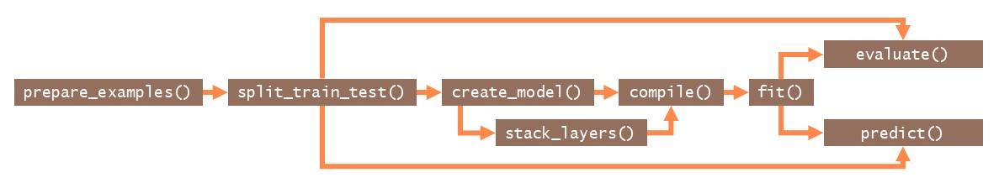
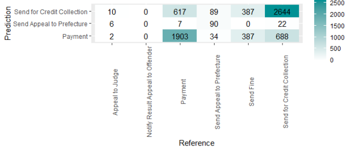

```{r, include = FALSE}
knitr::opts_chunk$set(
  eval = FALSE
)
```

```{r echo = F, out.width="25%",  eval = T, fig.align = "right"}

```

***

# Prediction Workflow

```{r setup, message = F, eval = T, collapse = TRUE, warning = F}
library(processpredictR)
library(bupaverse)
library(dplyr)
```


The goal of `processpredictR` is to perform prediction tasks on processes using event logs and Transformer models.
The 6 process monitoring tasks available are defined as follows:

* __outcome__: predict the case outcome, which can be the last activity, or a manually defined variable
* __next activity__: predict the next activity instance 
* __remaining trace__: predict the sequence of all next activity instances, where each entire sequence is regarded as a separate output class
* __remaining trace s2s__: predict the sequence of all next activity instances using __encoder-decoder__ architecture
* __next time__: predict the start time of the next activity instance
* __remaining time__: predict the remaining time till the end of the case

The overall approach using `processpredictR` is shown in the Figure below. `prepare_examples()` transforms logs into a dataset that can be used for training and prediction, which is thereafter split into train and test set. Subsequently a model is made, compiled and fitted. Finally, the model can be used to predict and can be evaluated.

```{r echo = F, eval = T, out.width = "100%", fig.align = "center", fig.cap="processpredictR workflow"}

```

Different levels of customization are offered. Using `create_model()`, a standard off-the-shelf model can be created for each of the supported tasks, including standard features. 

A first customization is to include additional features, such as case or event attributes. These can be configured in the `prepare_examples()` step, and they will be processed automatically (normalized for numerical features, or hot-encoded for categorical features). Furthermore, the dimensions of the model can be modified.

A further way to customize your model, is to only generate the input layer of the model with `create_model()`, and define the remainder of the model yourself by adding `keras` layers using the provided `stack_layers()` function.  More information about customization can be found [here](predict_adapt.html).

Going beyond that, you can also create the model entirely yourself using `keras`, including the preprocessing of the data. Auxiliary functions are provided to help you with, e.g., tokenizing activity sequences. More information on this approach can be found [here](predict_keras.html).

In the remainder of this tutorial, the general workflow will be described in more detail.  

## Preprocessing

As a first step in the process prediction workflow we use `prepare_examples()` to obtain a dataset, where: 

* each row/observation is a unique activity instance id,
* the prefix(_list) column stores the sequence of activities already executed in the case,
* necessary features and target variables are calculated and/or added

The returned object is of class `ppred_examples_df`, which inherits from `tbl_df`. 

In this tutorial we will use the `traffic_fines` event log from `eventdataR`. Note that both `eventlog` and `activitylog` objects, as defined by `bupaR` are supported.

```{r, eval = T}
df <- prepare_examples(traffic_fines, task = "outcome")
df
```

We split the transformed dataset `df` into train- and test sets for later use in `fit()` and `predict()`, respectively. The proportion of the train set is configured with the `split` argument. 

```{r, eval = T}
split <- df %>% split_train_test(split = 0.8)
split$train_df %>% head(5)
split$test_df %>% head(5)
```

It's important to note that the split is done at case level (a case is fully part of either the train data or either the test data). Furthermore, the split is done chronologically, meaning that the train set contains the split\% first cases, and the test set contains the (1-split)\% last cases. 

Note that because the split is done at case level, the percentage of all examples in the train set can be slightly different, as cases differ with respect their length. 

```{r, eval = T}
nrow(split$train_df) / nrow(df)
n_distinct(split$train_df$case_id) / n_distinct(df$case_id)
```

## Define model

The next step in the workflow is to build a model. `processpredictR` provides a default set of functions that are wrappers of generics provided by `keras`. For ease of use, the preprocessing steps, such as tokenizing of sequences, normalizing numerical features, etc. happen within the `create_model()` function and are abstracted from the user. 

Based on the train set we define the default transformer model, using `create_model()`.

```{r}
model <- split$train_df %>% create_model(name = "my_model") 
# pass arguments as ... that are applicable to keras::keras_model()

model # is a list 
```

```
#> Model: "my_model"
#> ________________________________________________________________________________
#>  Layer (type)                       Output Shape                    Param #     
#> ================================================================================
#>  input_1 (InputLayer)               [(None, 9)]                     0           
#>  token_and_position_embedding (Toke  (None, 9, 36)                  792         
#>  nAndPositionEmbedding)                                                         
#>  transformer_block (TransformerBloc  (None, 9, 36)                  26056       
#>  k)                                                                             
#>  global_average_pooling1d (GlobalAv  (None, 36)                     0           
#>  eragePooling1D)                                                                
#>  dropout_3 (Dropout)                (None, 36)                      0           
#>  dense_3 (Dense)                    (None, 64)                      2368        
#>  dropout_2 (Dropout)                (None, 64)                      0           
#>  dense_2 (Dense)                    (None, 6)                       390         
#> ================================================================================
#> Total params: 29,606
#> Trainable params: 29,606
#> Non-trainable params: 0
#> ________________________________________________________________________________
```

Some useful information and metrics are stored for tracebility and an easy extraction if needed.

```{r}
model %>% names() # objects from a returned list
```
```
#> $names
#> [1] "model"           "max_case_length" "number_features" "task"           
#> [5] "num_outputs"     "vocabulary"     

```
Note that `create_model()` returns a list, in which the actual keras model is stored under the element name `model`. Thus, we can use functions from the keras-package as follows:

```{r}
model$model$name # get the name of a model
```
```
#> [1] "my_model"

```

```{r}
model$model$non_trainable_variables # list of non-trainable parameters of a model
```
```
#> list()
```

The result of `create_model()` is assigned it's own class (`ppred_model`) for which the `processpredictR` provides the methods _compile()_, _fit()_, _predict()_ and _evaluate()_. 

## Compilation

The next step is to compile the model. By default, the loss function is the log-cosh or the categorical cross entropy, for regression tasks (next time and remaining time) and classification tasks, respectively. Naturally, it is possible to override these defaults.

```{r}
model %>% compile() # model compilation
```

```
#> ✔ Compilation complete!
```

## Training

Training of the model is done with the `fit()` function. During training, a visualization window will open in the Viewer-pane to show the progress in terms of loss. Optionally, the result of `fit()` can be assigned to an object to access the training metrics specified in _compile()_. The number of epochs to train for can be configured using the `epochs` argument. 

```{r}
hist <- fit(object = model, train_data = split$train_df, epochs = 5)
```

```{r}
hist$params
```

```
#> $verbose
#> [1] 1
#> 
#> $epochs
#> [1] 5
#> 
#> $steps
#> [1] 2227
```
```{r}
hist$metrics
```
```
#> $loss
#> [1] 0.7875332 0.7410239 0.7388409 0.7385073 0.7363014
#> 
#> $sparse_categorical_accuracy
#> [1] 0.6539739 0.6713067 0.6730579 0.6735967 0.6747193
#> 
#> $val_loss
#> [1] 0.7307042 0.7261314 0.7407018 0.7326428 0.7317348
#> 
#> $val_sparse_categorical_accuracy
#> [1] 0.6725934 0.6727730 0.6725934 0.6725934 0.6722342
``` 

### Make predictions

The method  `predict()` can return 3 types of output, by setting the argument `output` to "append", "y_pred" or "raw". 

Test dataset with appended predicted values (`output = "append"`):

```{r}
# make predictions on the test set
predictions <- model %>% predict(test_data = split$test_df, 
                                 output = "append") # default
predictions %>% head(5)
```

```
#> # A tibble: 5 × 13
#>   ith_case case_id prefix                prefix_…¹ outcome     k activ…² resou…³
#>      <int> <chr>   <chr>                 <list>    <fct>   <dbl> <chr>   <fct>  
#> 1     8001 A24869  Create Fine           <chr [1]> Payment     0 Create… 559    
#> 2     8001 A24869  Create Fine - Payment <chr [2]> Payment     1 Payment <NA>   
#> 3     8002 A24871  Create Fine           <chr [1]> Payment     0 Create… 559    
#> 4     8002 A24871  Create Fine - Payment <chr [2]> Payment     1 Payment <NA>   
#> 5     8003 A24872  Create Fine           <chr [1]> Send f…     0 Create… 559    
#> # … with 5 more variables: start_time <dttm>, end_time <dttm>,
#> #   remaining_trace_list <list>, y_pred <dbl>, pred_outcome <chr>, and
#> #   abbreviated variable names ¹​prefix_list, ²​activity, ³​resource
``` 

<details>
<summary>raw predicted values (`output = "raw"`)</summary>
<p>
```
#>              Payment Send for Credit Collection    Send Fine
#>    [1,] 4.966056e-01                0.344094276 1.423686e-01
#>    [2,] 9.984029e-01                0.001501600 8.890528e-05
#>    [3,] 4.966056e-01                0.344094276 1.423686e-01
#>    [4,] 9.984029e-01                0.001501600 8.890528e-05
#>    [5,] 4.966056e-01                0.344094276 1.423686e-01
#>    [6,] 1.556145e-01                0.518976271 2.884890e-01
#>    [7,] 2.345311e-01                0.715000629 5.147375e-06
#>    [8,] 2.627363e-01                0.726804197 5.480492e-06
#>    [9,] 3.347774e-05                0.999961376 2.501280e-08
#>   [10,] 4.966056e-01                0.344094276 1.423686e-01
```
</details>
</p>

<details>
<summary>predicted values with postprocessing (`output = "y_pred"`)</summary>
```
#>    [1] "Payment"                    "Payment"                   
#>    [3] "Payment"                    "Payment"                   
#>    [5] "Payment"                    "Send for Credit Collection"
#>    [7] "Send for Credit Collection" "Send for Credit Collection"
#>    [9] "Send for Credit Collection" "Payment"                   
#>   [11] "Send for Credit Collection" "Payment"                   
#>   [13] "Send for Credit Collection" "Payment"                   
#>   [15] "Send for Credit Collection" "Send for Credit Collection"
#>   [17] "Send for Credit Collection" "Send for Credit Collection"
#>   [19] "Payment"                    "Send for Credit Collection"
```
</details>
</p>

### Visualize predictions

For the classification tasks outcome and next activity a `confusion_matrix()` function is provided to visualize the results. 

```{r}
predictions %>% class
```
```
#> [1] "ppred_predictions" "ppred_examples_df" "ppred_examples_df"
#> [4] "ppred_examples_df" "tbl_df"            "tbl"              
#> [7] "data.frame"
```
```{r}
# print confusion matrix
confusion_matrix(predictions)
```
```
#>                                   
#>                                    Payment Send Appeal to Prefecture
#>   Appeal to Judge                        2                         6
#>   Notify Result Appeal to Offender       0                         0
#>   Payment                             1903                         7
#>   Send Appeal to Prefecture             34                        90
#>   Send Fine                            387                         0
#>   Send for Credit Collection           688                        22
#>                                   
#>                                    Send for Credit Collection
#>   Appeal to Judge                                          10
#>   Notify Result Appeal to Offender                          0
#>   Payment                                                 617
#>   Send Appeal to Prefecture                                89
#>   Send Fine                                               387
#>   Send for Credit Collection                             2644
```

Plot method for the confusion matrix (classification) or a scatter plot (regression).

```{r, out.width="100%", fig.width = 7}
# plot confusion matrix in a bupaR style
plot(predictions) +
  theme(axis.text.x = element_text(angle = 90))
```

```{r, out.width="80%", fig.width = 7, eval = T, echo = F} 

```

## Evaluate model

Returns loss and metrics specified in _compile()_.

```{r}
model %>% evaluate(split$test_df)
```

```
#>                        loss sparse_categorical_accuracy 
#>                   0.7779053                   0.6716526
```

***

Read more: 

```{r footer, results = "asis", echo = F, eval = T, collapse = F}
source("htmlbuttons.R")
create_buttons(df, "predict_workflow.html")
```


