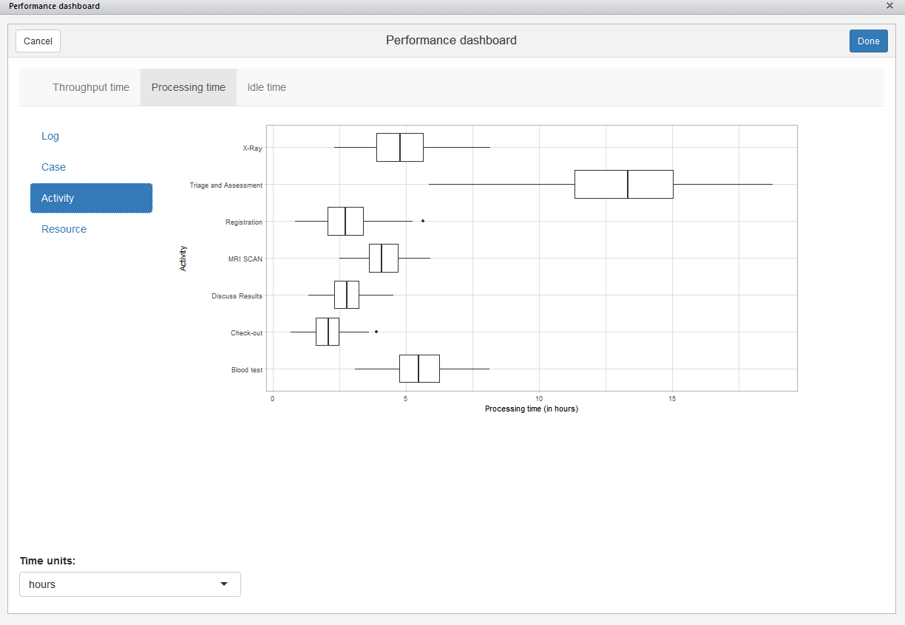
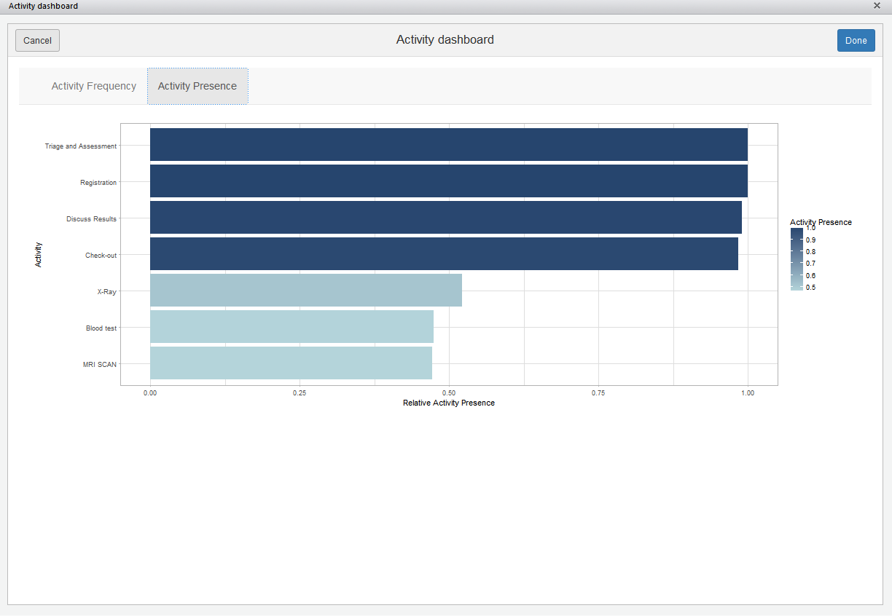
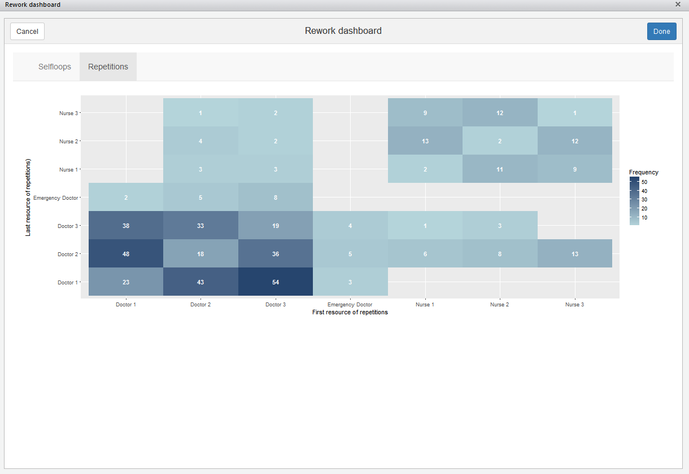
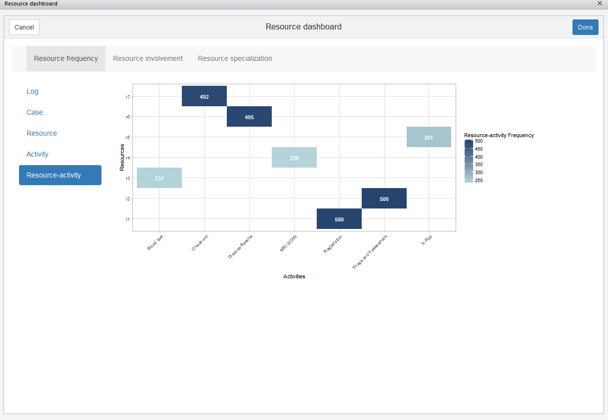

## Introduction
```{r echo = F}
htmltools::includeHTML("tracking_google_analytics.html")
```
The processmonitR package provides several predefined dashboard to monitor process based on event logs. They can be launched using the following functions:

*	`performance_dashboard`: to look at throughput time, processing time, idle time
*	`activity_dashboard`: to look at activity frequency and presence
*	`rework_dashboard`: to look at rework (selfloops, repetitions)
*	`resource_dashboard`: to look at resource frequency, involvement, specialization


## Examples

Below, you can find examples of the dashboard for the patients event log.

### Performance


```{r echo = F, fig.align = "center", out.width=900}

```


### Activity

```{r echo = F, fig.align = "center", out.width=900}

```

### Rework

```{r echo = F, fig.align = "center", out.width=900}

```

### Resources

```{r echo = F, fig.align = "center", out.width=900}

```
	
	
	
	
	